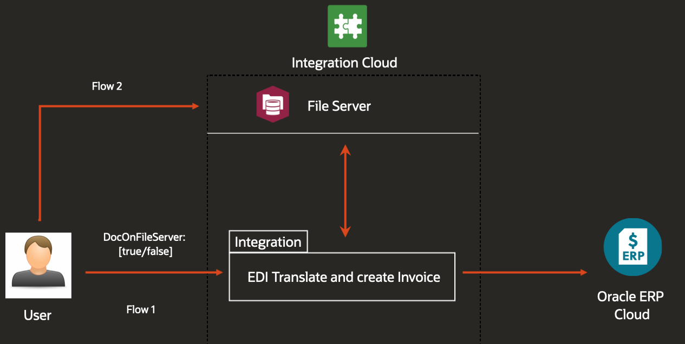

# Oracle Integration Cloud - B2B + File Server + ERP

This integration based on a flag decides whether to look for the B2B 810 file in the payload or the OIC attached FileServer(user has to provide path of file) and then  translates into XML. Finally the integration will map the translated XML to Oracle ERP payload.

## Architecture

