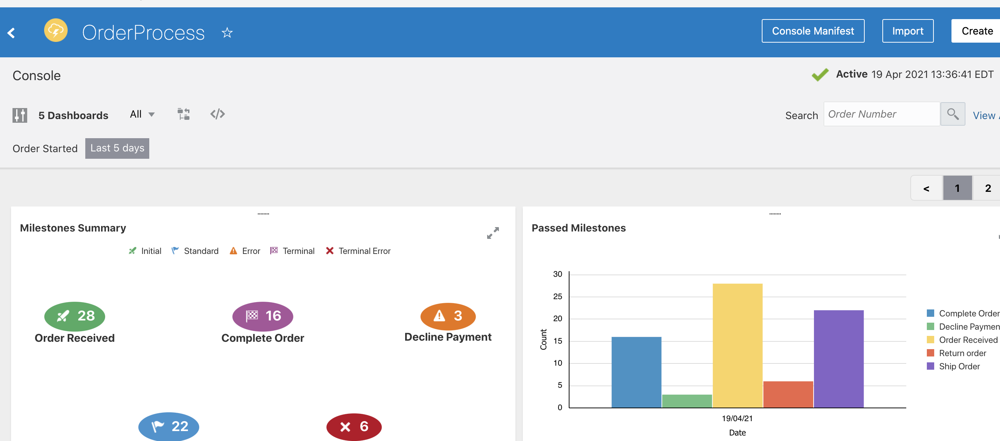

# Oracle Integration Cloud + Insights

## Use Case

* This use case explores the use of Oracle Integration Insight. Integration Insight (aka Insight) puts business users in control by allowing them to model, collect and monitor business-level metrics without reliance on IT.

* How To Run:

  * a. Import Integration first and configure the adapters accrodingly. 
  * b. Import the OrderProcess.zip into Insight on the insight model page.
  * c. Activate Integrations. 
  * d. Activate OrderProcess Insight model.
  * e. Edit the dataFeederScript.sh and add the URL and base64 auth to the respective variables. Run the script to simulate data entry of orders.
  * f. Go to Insight model and verify everything is there.

  Note: You do not need RandomUtils_01.00.0000.zip. This includes it anyways.

## Built In Dashboards

