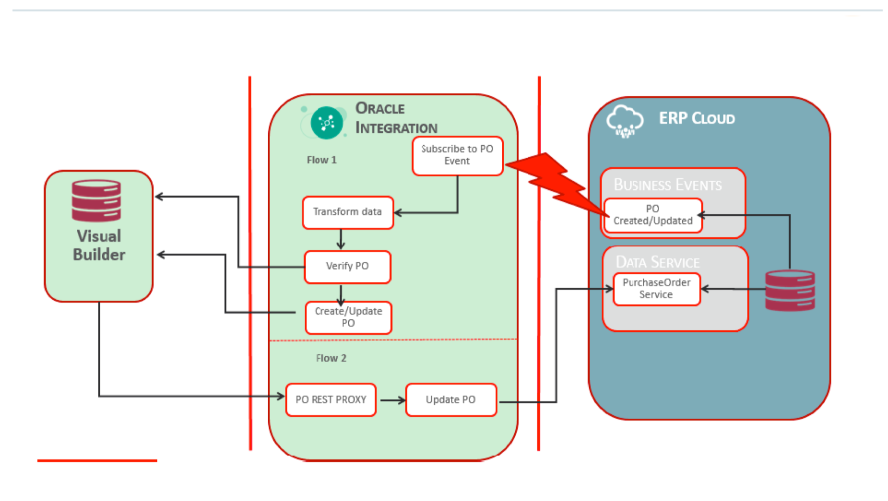
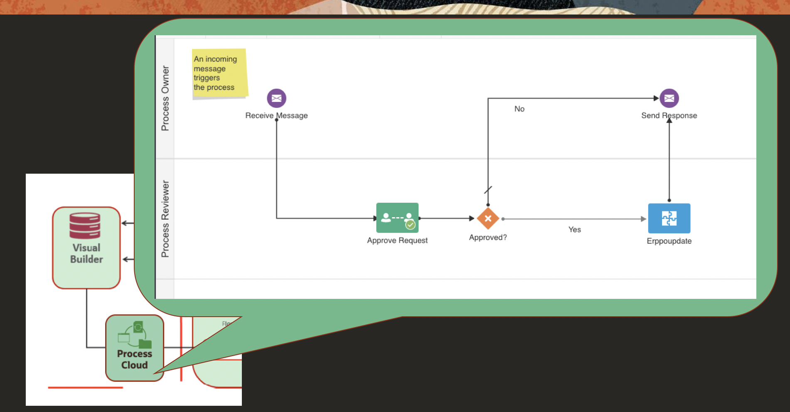

# Oracle Integration Cloud + Process Cloud + Visual Buidler Cloud + ERP Cloud Demo

## Use Case

* This use case explores the use of Oracle Integration to subscribe to Oracle ERP Cloud Events and push the relevant event information to downstream systems. As part of the lab you would be building the below use case scenario. 

  * a. User creates a Purchase Order(PO) in ERP Cloud and a PO event is raised (Flow1) 
  * b. Oracle Integration subscribes to the PO event, transforms and pushes the relevant information to a custom table (VBCS) (Flow1) 
  * c. User updates the "Note To Supplier" information to the PO record from the VBCS Web App. (Flow2) 
  * d. PO Record in ERP Cloud is updated with the information in ERP cloud (Flow2)
  
  Note: Since the PO event is also raised for update, Flow 1 will be triggered again and you should see the updated value in the VB app.

## Architecture

## Process Flow

